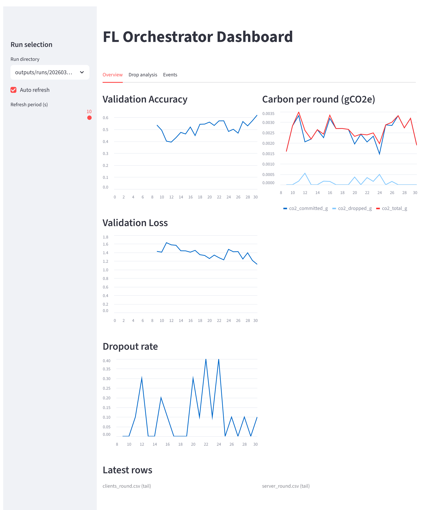
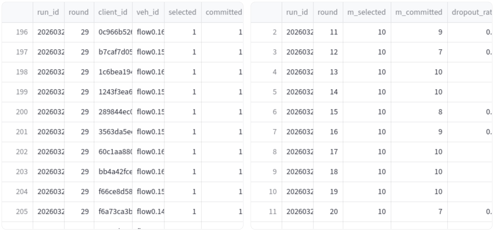
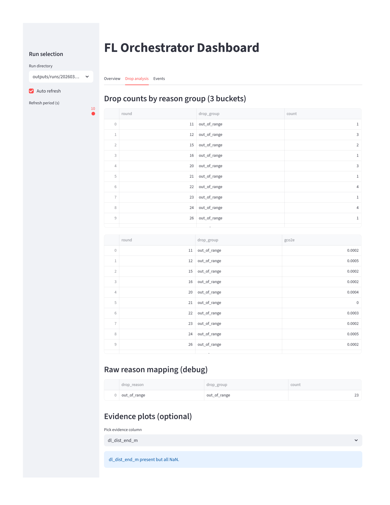
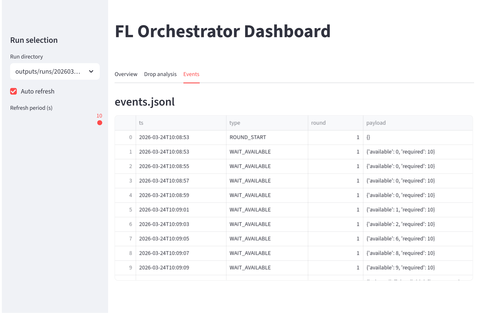

# FedITS: Federated Learning Orchestration in Vehicular Networks 🚗📡🤖


## 1. Overview
This project provides a comprehensive co-simulation framework that integrates **Federated Learning (FL)** with **Vehicular Ad Hoc Networks (VANETs)**. By combining **Flower** (for FL) with **Veins, SUMO, and OMNeT++** (for mobility and network simulation), it enables researchers to evaluate FL algorithms under realistic vehicular mobility, communication latency, and dynamic topology constraints.

### 🌟 Key Features
* **Decoupled Co-Simulation Architecture:** Isolates the FL logic into Docker containers (Flower + PyTorch) while running the network simulation natively in OMNeT++, bridged by a custom Python Orchestrator.
* **Realistic Constraints:** Judges FL model downlink/uplink reachability and transmission delays based on real-time vehicle positions, RSU coverage, and SINR.
* **Energy & Carbon Awareness:** Integrates with the Electricity Maps API to calculate energy consumption and carbon emissions (gCO2e) during computation and communication.
* **Non-IID Data Partitioning:** Built-in support for Dirichlet distribution-based label skew partitioning for datasets like CIFAR-10 and FashionMNIST.
* **Real-time Monitoring Dashboard:** An interactive Streamlit web UI to dynamically monitor drops, training accuracy, energy metrics, and simulation events.

---

## 2. Prerequisites
This guide assumes you are starting with a clean **Instant Veins VirtualBox VM** (Ubuntu/Debian based). 

> 👉 **Get Instant Veins 5.2-i1:**
* **Direct Download Link:** [instant-veins-5.2-i1.ova](https://veins.car2x.org/download/instant-veins-5.2-i1.ova)
* **Download Page:** [Veins Downloads](https://veins.car2x.org/download/)
* **Documentation & Intro:** [Instant Veins Documentation](https://veins.car2x.org/documentation/instant-veins/)

* **RAM:** >= 16GB recommended (due to multiple Docker containers and OMNeT++ running simultaneously).
* **CPU:** Multi-core processor.
* **Disk Space:** **80GB or more** (to accommodate Docker images, build artifacts, and simulation logs).

---

## 3. Quick Installation

We provide a one-click setup script to fully automate the deployment process on an Instant Veins VM. It will install Docker, deploy the project directories, compile the necessary C++ modules, and install the Python dependencies.

**Step 1:** Clone the repository to your home directory:
```bash
cd ~ && git clone https://github.com/lukaschare/FedITS-Tool.git
cd FedITS-Tool
```

**Step 2:** Run the automated setup script:

```Bash
chmod +x setup_fedits_eng.sh
./setup_fedits_eng.sh
```

_(Note: The script will ask for your `sudo` password to install system packages like Docker. If it adds you to the Docker group for the first time, it will prompt you to log out and log back into the VM.)_

---


## 4. Running the Simulation

The recommended way to launch FedITS is through a **scenario `.env` file**.
This keeps the experiment configuration reproducible and allows the launcher to automatically propagate the main parameters (such as `NUM_VEH`, `M`, `ROUNDS`, `RSU_X`, `RSU_Y`, `RSU_R`, `MAP_SIZE`, and SUMO flow settings) to the Docker stack, OMNeT++ configuration, and SUMO route file in one place. 

First, move to the project root:

```bash
cd ~/fedits-tool
```

### Recommended scenario-based startup

You can prepare one scenario file per use case, for example:

* `scenarios/usecase1_ran2000_100_10.env`
* `scenarios/usecase2_ran500_100_10.env`
* `scenarios/usecase3_ran500_500_50.env`   

> **💡 Tip:** If the newly opened terminal window prompts you for a `sudo` password (e.g., when using `--sudo-docker`), simply type **`veins`** and press Enter to let the containers start.


### Option A: GUI mode with SUMO visualization

This mode is best when you want to **observe the mobility process visually**.
It opens terminal windows for SUMO, Veins, Docker Compose, and optionally the Streamlit dashboard. In GUI mode, the launcher defaults to `sumo-gui`. 

```bash
/home/veins/fedits-tool/scripts/run_fedits_scenario_v2.sh gui \
  --project-root /home/veins/fedits-tool \
  --scenario /home/veins/fedits-tool/scenarios/usecase2_ran500_100_10.env \
  --sudo-docker
```


### Option B: GUI mode without showing the SUMO map window

This mode is useful when you still want the **multi-window launcher experience** (Veins, Docker, dashboard logs in separate terminals), but do **not** want the SUMO graphical map to be displayed.
The key is to keep `gui` mode while explicitly switching SUMO to non-graphical mode via `--sumo sumo`. 

```bash
/home/veins/fedits-tool/scripts/run_fedits_scenario_v2.sh gui \
  --project-root /home/veins/fedits-tool \
  --scenario /home/veins/fedits-tool/scenarios/usecase2_ran500_100_10.env \
  --sumo sumo \
  --sudo-docker
```

### Option C: Fully headless mode

This mode is recommended for **larger experiments**, long runs, or batch execution.
SUMO launchd and Veins run in the background, while Docker Compose runs in the current shell. 

```bash
/home/veins/fedits-tool/scripts/run_fedits_scenario_v2.sh headless \
  --project-root /home/veins/fedits-tool \
  --scenario /home/veins/fedits-tool/scenarios/usecase2_ran500_100_10.env \
  --sudo-docker
```

### Stopping a run

To stop the current experiment cleanly:

```bash
/home/veins/fedits-tool/scripts/stop_fedits_scenario.sh \
  --project-root /home/veins/fedits-tool \
  --sudo-docker
```

`--sudo-docker` forces the launcher to use `sudo docker`, which helps avoid permission issues when starting or stopping the Docker-based FL services.

The stop script shuts down Docker Compose and terminates the related host-side Veins, SUMO, and Streamlit processes. 

---

## 5. Real-Time Dashboard 📊

When the dashboard is enabled, Streamlit becomes available at:

👉 **[http://localhost:8501](http://localhost:8501)**

> **💡 Tip (Refreshing the Dashboard):** When launching a new scenario, Streamlit might start faster than the new log directories are created. If the "Select Run Directory" dropdown only shows older runs, simply **refresh your browser page** after a few seconds so it can detect the newly generated log folder.


The dashboard is designed around three tabs:

### 5.1 Overview

The **Overview** tab provides a compact summary of the current run, including:

* validation or training accuracy over rounds,
* validation or training loss over rounds,
* dropout rate,
* per-round carbon metrics (`committed`, `dropped`, and `total`),
* latest rows from `clients_round.csv` and `server_round.csv`. 




### 5.2 Drop Analysis

The **Drop analysis** tab helps diagnose why selected clients fail to contribute updates.
It groups dropped clients into three coarse categories:

* `out_of_map`
* `out_of_range`
* `bad_signal_or_deadline`

It also provides per-round stacked statistics and raw reason mappings, which are particularly useful for analyzing mobility-induced failures and deadline misses. 




### 5.3 Events

The **Events** tab displays the content of `events.jsonl`, which records round-level execution events emitted by the FL server.
This tab is useful for inspecting the chronological orchestration flow, including client selection, reception, verdict, aggregation, and round completion.  




---

## 6. Repository Structure

* `setup_fedits_eng.sh` - Automated deployment scripts.
* `docker/` - Docker Compose and Dockerfiles for orchestrator, Flower server, and Flower clients.
* `fedits-tool/orchestrator/` - Control plane logic (`orch_core.py`, `orch_service.py`) that coordinates Veins and Flower.
* `fedits-tool/fl/` - Flower server/client logic and the Streamlit dashboard.
* `fedits_veins_rsu/` - Veins / OMNeT++ side implementation, including the `ControlServer`.
* `scenarios/` - Scenario `.env` files for reproducible experiment launching.
* `outputs/` - Structured experiment outputs generated during runs.
* `logs/` - Launcher and runtime logs for each started scenario.   

---


## 7. Logs and Recorded Outputs 📝

FedITS records two complementary classes of outputs:
**(1) structured experiment results** for analysis, and **(2) launcher/runtime logs** for debugging and reproducibility.

### 7.1 Structured experiment outputs

For each run, the orchestrator and FL server write structured artifacts under:

```bash
outputs/runs/<run_id>/
```

Typical files include:

* `config_snapshot.json`
  Snapshot of the orchestrator-side configuration used for that run.

* `clients_round.csv`
  Per-client, per-round trace containing selection outcome, commit/drop status, timing, link indicators, and energy/carbon fields.

* `server_round.csv`
  Per-round server summary including selected/committed counts, dropout rate, global model norm, and carbon totals.

* `round_metrics.csv`
  Training-side aggregated metrics such as selected/received/kept/dropped counts, aggregation scalar, train/validation loss, and accuracy.

* `events.jsonl`
  Chronological round events emitted by the FL server, useful for debugging orchestration flow.

* `manifest.json`
  Run-level metadata written by the Flower server logger.  

In addition, dataset partition files are generated under:

```bash
outputs/partitions/
```

These partition files store IID or Dirichlet-based client splits and make repeated experiments easier to reproduce.  

### 7.2 Launcher and runtime logs

Each scenario launch also creates a run folder under:

```bash
logs/<RUN_NAME>/
```

Typical files include:

* `run_info.txt`
  Human-readable summary of the launch configuration.

* `veins_launchd_<timestamp>.log`
  Output from `veins_launchd`.

* `veins_run_<timestamp>.log`
  Runtime log from the Veins / OMNeT++ process.

* `docker_<timestamp>.log`
  Combined Docker Compose output.

* `dashboard_<timestamp>.log`
  Streamlit dashboard log, when enabled.

* `docker-compose.yml.bak`
  Backup of the Docker Compose file before scenario patching.

* `omnetpp.ini.bak`
  Backup of the OMNeT++ configuration before scenario patching.

* `erlangen.rou.xml.bak`
  Backup of the SUMO route file before scenario patching.

* `launchers/`
  Helper shell launchers generated for GUI mode. 

### 7.3 Why both output locations matter

A useful rule of thumb is:

* use `outputs/runs/<run_id>/` for **plots, metrics, and paper figures**;
* use `logs/<RUN_NAME>/` for **debugging failed launches, port conflicts, or integration issues**.   

---

## 8. Troubleshooting and Practical Notes 🔧

This section summarizes common issues encountered when changing scenario parameters during experiments.

### 8.1 No clients are selected or no training starts

**Symptoms**

* a round starts, but `selected=0`;
* no client containers actually train;
* the dashboard remains mostly empty.

**Typical causes**

* too few vehicles are inside RSU coverage at the round start;
* `RSU_R` is too small for the current mobility setting;
* `SUMO_FLOW_NUMBER` is too low or `SUMO_FLOW_PERIOD` is too large;
* `MIN_AVAILABLE_CLIENTS` or `MIN_FIT_CLIENTS` is set too high relative to `SCALE`.  

**What to check**

* verify the scenario file first;
* inspect `server_round.csv` and `events.jsonl`;
* in GUI mode, confirm whether vehicles actually pass through the RSU region.

### 8.2 Many clients drop with `out_of_range` or `left_map`

**Symptoms**

* clients are selected, but many fail before commit;
* the Drop analysis tab is dominated by mobility-related failures.

**Typical causes**

* RSU coverage is too small;
* the model payload is too large for the available contact duration;
* the round deadline is too strict;
* the traffic pattern causes vehicles to leave coverage quickly.  

**Possible fixes**

* increase `RSU_R`;
* increase `DEADLINE_S`;
* reduce `MODEL_DOWN_BYTES` / `MODEL_UP_BYTES`;
* increase traffic density via `SUMO_FLOW_NUMBER` or decrease `SUMO_FLOW_PERIOD`.

### 8.3 SUMO GUI does not appear

**Typical cause**

* you launched with `--sumo sumo`, which is intentionally non-graphical.

**Fix**
Use:

```bash
./run_fedits_scenario_v2.sh gui --sumo sumo-gui --scenario scenarios/usecase1_ran2000_100_10.env
```

In plain `gui` mode, `sumo-gui` is already the default unless you override it. 

### 8.4 Dashboard opens but shows little or no data

**Typical causes**

* the first round has not finished yet;
* dashboard was disabled;
* the run produced no structured output due to an earlier startup issue.

**What to check**

* confirm that `ENABLE_DASHBOARD=1` or `--dashboard` is enabled when needed;
* verify that `outputs/runs/<run_id>/` exists;
* inspect `round_metrics.csv`, `clients_round.csv`, and `server_round.csv`.  

### 8.5 Docker permission errors

**Symptoms**

* `docker compose` fails with permission-related messages.

**Fixes**

* rerun with `--sudo-docker`, or
* add your user to the Docker group and re-login.  

### 8.6 Port conflicts

FedITS uses several ports across the stack, including:

* `7070` for the orchestrator service,
* `8080` for the Flower server,
* `8501` for Streamlit,
* `10001` for the Veins ControlServer,
* `9999` for SUMO TraCI in the Veins setup.   

If a new run fails immediately, stop the previous one first:

```bash
./stop_fedits_scenario.sh
```

### 8.7 Large-scale runs become slow or unstable

**Typical causes**

* too many Docker clients started at once;
* insufficient RAM or CPU for the chosen `SCALE`, `M`, and dataset/model combination;
* GUI mode adds extra overhead during large experiments.

**Practical suggestions**

* prefer `headless` mode for scale experiments;
* reduce `SCALE` first if you only need functional validation;
* keep GUI mode for demonstration runs, not for stress tests. 

### 8.8 Manual file edits can create inconsistent configurations

The scenario launcher is designed to keep Docker, OMNeT++, and SUMO aligned automatically by patching the relevant files before launch.
If you manually edit those files afterward, make sure the following stay consistent:

* `NUM_VEH`
* `M`
* `ROUNDS`
* `RSU_X`, `RSU_Y`, `RSU_R`
* `MAP_SIZE`
* SUMO flow number and period. 

Otherwise, you may observe puzzling behavior such as no in-range vehicles, mismatched client counts, or unexpected drop patterns.

---

## 9. Citation / Acknowledgement

If you use this framework in your research, please cite the corresponding paper and acknowledge the software stack built on **Flower**, **SUMO**, **OMNeT++**, and **Veins**.

<!-- Add BibTeX entry here once the paper metadata is finalized -->


